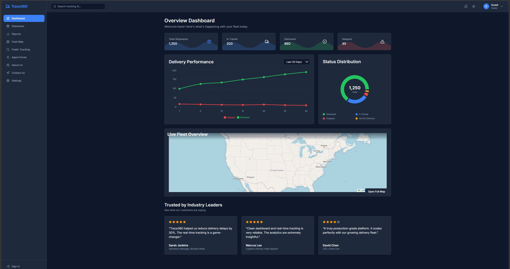
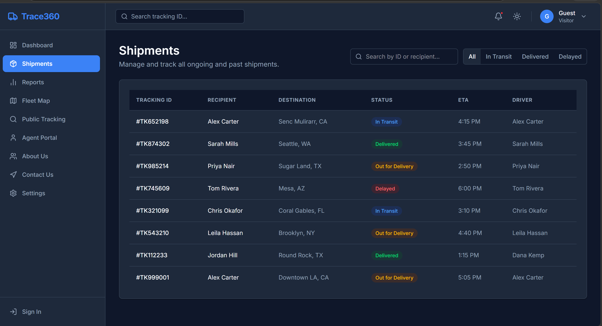
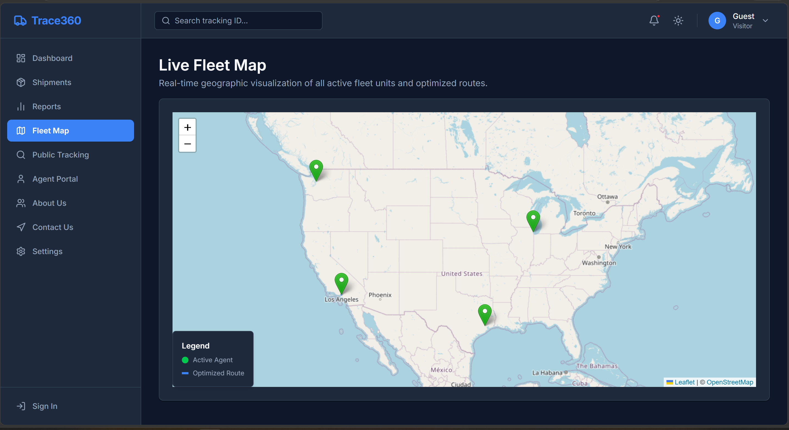
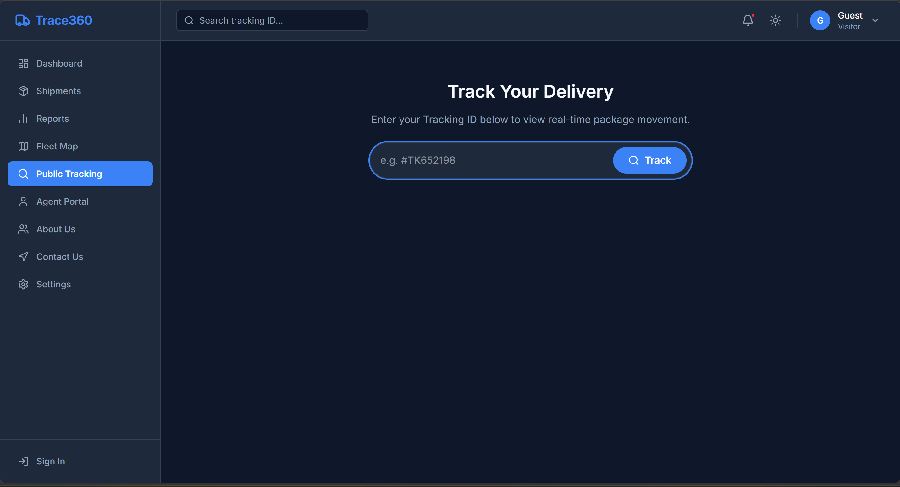
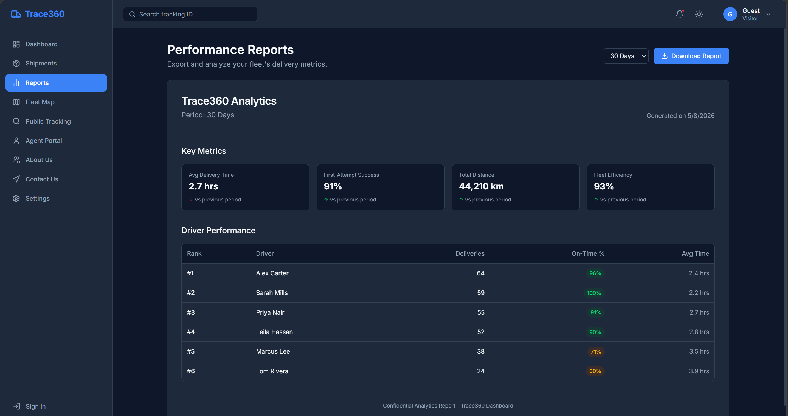
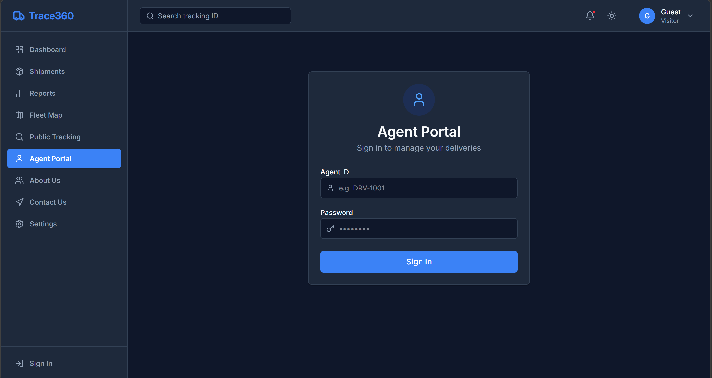
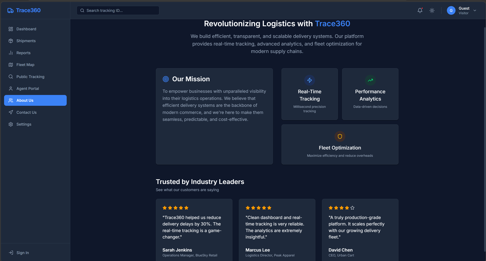
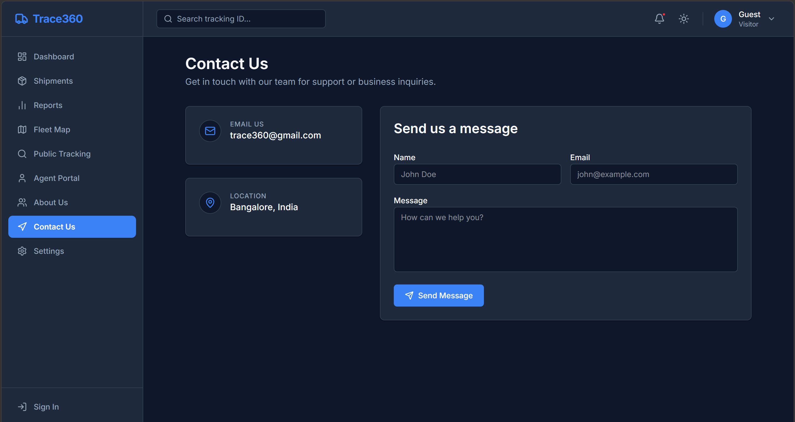
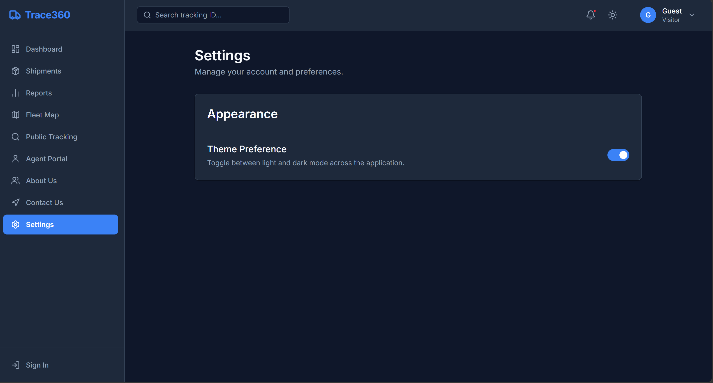

# 🚚 Trace360 – Real-Time Package Delivery & GPS Tracking System

<div align="center">

# 🚛 Trace360
### Smart Logistics Tracking & Fleet Monitoring Platform

🌐 **Live Demo:**  
https://trace360-j0exm3w78-saurabh-kumar-s-projects-ea4fd3f4.vercel.app/

</div>

---

# 📌 Project Overview

Trace360 is a full-stack GPS-enabled logistics tracking platform designed to provide real-time package monitoring, fleet tracking, shipment analytics, and delivery management.

The system allows customers to track packages live on an interactive map while delivery agents periodically update GPS coordinates through the platform.

It combines:
- Real-time tracking
- GPS integration
- Shipment management
- Fleet analytics
- Delivery reports
- Modern dashboard UI

---

# 📌 Problem Statement

Traditional logistics systems often fail to provide real-time shipment visibility and accurate delivery tracking. Customers face uncertainty regarding package location and estimated delivery times, while logistics companies struggle with fleet monitoring and operational transparency.

Trace360 solves this issue by developing a GPS-enabled logistics tracking system where:
- Users can track package movement live
- Delivery agents update GPS coordinates periodically
- Admins can monitor fleet activity
- Reports and analytics improve operational efficiency

The platform enhances transparency, delivery management, and customer experience using modern full-stack technologies.

---

# 🎯 Objectives

- Build a real-time package tracking platform
- Integrate GPS-based fleet monitoring
- Enable shipment status updates
- Provide public package tracking
- Visualize live fleet movement
- Generate delivery analytics reports
- Develop a scalable logistics management system

---

# ✨ Features

## 📊 Dashboard
- Shipment overview
- Delivery analytics
- Live statistics
- Performance charts
- Fleet activity monitoring

## 📦 Shipment Management
- Track all shipments
- ETA updates
- Status filtering
- Driver allocation

## 🗺️ Fleet Map
- Real-time GPS visualization
- Interactive maps
- Route monitoring
- Fleet overview

## 🔎 Public Tracking
- Track shipments using Tracking ID
- Real-time package updates
- Public access interface

## 👨‍💼 Agent Portal
- Secure authentication
- Delivery management
- GPS coordinate updates

## 📈 Reports & Analytics
- Fleet efficiency reports
- Driver performance analytics
- Delivery success monitoring

## ⚙️ Settings
- Dark mode support
- Theme customization
- Responsive design

---

# 🛠️ Tech Stack

## Frontend
- React.js
- Tailwind CSS
- Chart.js / Recharts
- Leaflet Maps
- Axios

## Backend
- Spring Boot (Java)
- REST APIs
- WebSocket
- JWT Authentication

## Database
- MySQL

## Deployment
- Frontend → Vercel
- Backend → Render

---

# 📸 Project Screenshots

---

## 🏠 Dashboard



---

## 📦 Shipments Module



---

## 🗺️ Fleet Map



---

## 🔎 Public Tracking



---

## 📈 Reports & Analytics



---

## 👨‍💼 Agent Portal



---

## ℹ️ About Us



---

## 📬 Contact Us



---

## ⚙️ Settings



---

# 🧠 System Workflow

```text
Customer places shipment request
            ↓
Shipment stored in database
            ↓
Delivery agent assigned
            ↓
Agent updates GPS coordinates
            ↓
Backend processes live updates
            ↓
Frontend displays live tracking
            ↓
Customer tracks package in real-time
```

---

# 🏗️ System Architecture

```text
Frontend (React + Tailwind CSS)
                ↓
      REST APIs / WebSocket
                ↓
      Spring Boot Backend
                ↓
            MySQL
```


# 🔐 Security Features

- JWT Authentication
- Protected APIs
- Secure Login System
- Role-based Access
- Route Protection

---

# 🌐 Deployment

## Frontend Deployment
- Vercel

## Backend Deployment
- Render

---

# 👩‍💻 Team Members

| Name |
|---|---|
| 👩‍💻 Mimansa Sharma | Team Lead |
| 👨‍💻 Saurabh |
| 👨‍💻 Sayan |
| 👨‍💻 Lokesh | 

---

# 🌟 Future Enhancements

- AI-based route optimization
- Real GPS device integration
- Push notifications
- Mobile application
- Admin management system
- Predictive delivery analytics

---

# 📌 Conclusion

Trace360 is a scalable and modern logistics tracking system that integrates real-time GPS tracking, shipment management, analytics, and delivery monitoring into a single platform.

The project demonstrates:
- Full-stack development
- REST API integration
- Real-time communication
- GPS & map integration
- Responsive dashboard UI
- Modern logistics management architecture

---

# 🔗 Live Demo

🌐 https://trace360-j0exm3w78-saurabh-kumar-s-projects-ea4fd3f4.vercel.app/

---

<div align="center">

## 🚚 Trace360 — Real-Time Logistics Tracking System

Built using React.js + Spring Boot + MySQL

</div>
